<div align="center">

# 🚀 DivSocial Internship — Daily Learning Log

### A day-by-day journey through Web Fundamentals, DevTools, HTML, CSS, JavaScript & Backend Basics


</div>

---

## 📌 About This Repository

This repository documents my **daily progress during the DivSocial Internship**. Each day covers a specific topic — from how the web works under the hood, to browser debugging, to building and styling a resume with HTML/CSS, to JavaScript fundamentals, browser storage, and basic backend/Node.js concepts. Diagrams are included to make each concept easier to visualize and revise.

## 📅 Table of Contents

| Day | Topic |
|-----|-------|
| [Day 1](#day-1--how-a-website-works-5-stages) | 🌐 How a Website Works (5 Stages) |
| [Day 2](#day-2--debugging--devtools-in-the-browser) | 🐞 Debugging & DevTools in the Browser |
| [Day 3](#day-3--html5-tags) | 🏷️ HTML5 Tags |
| [Day 4](#day-4--basic-resume-build-html) | 📄 Basic Resume Build (HTML) |
| [Day 5](#day-5--css-boilerplate--selectors) | 🎨 CSS Boilerplate & Selectors |
| [Day 6](#day-6--box-model-flexbox--grid) | 📦 Box Model, Flexbox & Grid |
| [Day 7](#day-7--when-to-use-flexbox-vs-grid) | ⚖️ When to Use Flexbox vs Grid |
| [Day 8](#day-8--styling-the-resume-with-css) | 💅 Styling the Resume with CSS |
| [Day 9](#day-9--javascript-fundamentals) | ⚙️ JavaScript Fundamentals |
| [Day 10](#day-10--functions-in-js) | 🔧 Functions in JS |
| [Day 11](#day-11--arrays--array-methods) | 📚 Arrays & Array Methods |
| [Day 12](#day-12--apis--basic-backend-concepts) | 🌍 APIs & Basic Backend Concepts |
| [Day 13 (13 July)](#day-13-13-july--devtools-application-tab-storage--cookies) | 🗄️ DevTools Application Tab, Storage & Cookies |
| [Day 14 (15 July)](#day-14-15-july--npm-nodejs--express-basics) | 📦 npm, Node.js & Express Basics |

---

## Day 1 — How a Website Works (5 Stages)

When you type a URL and press **Enter**, the browser silently runs through **5 major stages** before the page appears on screen.

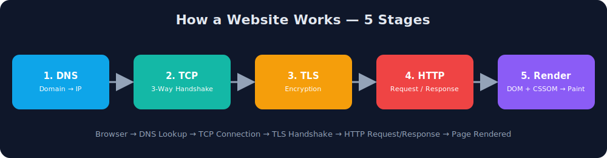

### 1️⃣ DNS (Domain Name System)
Think of DNS as the **phonebook of the internet**. It translates a human-friendly domain name into a machine-friendly IP address.

```
www.example.com  →  142.250.183.14
```

### 2️⃣ TCP (Transmission Control Protocol)
Before any data is exchanged, the client and server establish a reliable connection using the **3-Way Handshake**:

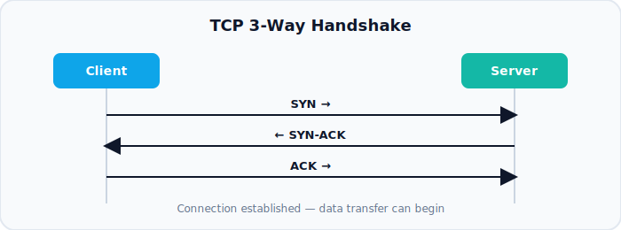

```
Client → SYN       → Server   (Let's connect)
Client ← SYN-ACK   ← Server   (Okay, agreed)
Client → ACK       → Server   (Confirmed, connected)
```

### 3️⃣ TLS (Transport Layer Security)
Encrypts the connection so the exchanged data can't be read or tampered with (this is what turns **HTTP into HTTPS** 🔒). Involves a certificate exchange and key negotiation between client & server.

### 4️⃣ HTTP (HyperText Transfer Protocol)
The actual request and response cycle:

```http
GET /index.html HTTP/1.1
Host: www.example.com
```

```http
HTTP/1.1 200 OK
Content-Type: text/html
```

### 5️⃣ Render
The browser:
1. Parses HTML → builds the **DOM** (Document Object Model)
2. Parses CSS → builds the **CSSOM** (CSS Object Model)
3. Combines DOM + CSSOM → **Render Tree**
4. **Layout** → calculates size/position of every element
5. **Paint** → pixels finally appear on screen

---

## Day 2 — Debugging & DevTools in the Browser

Browser DevTools (`F12` or `Ctrl+Shift+I` / `Cmd+Opt+I` on Mac) are the most important tool for any frontend developer.

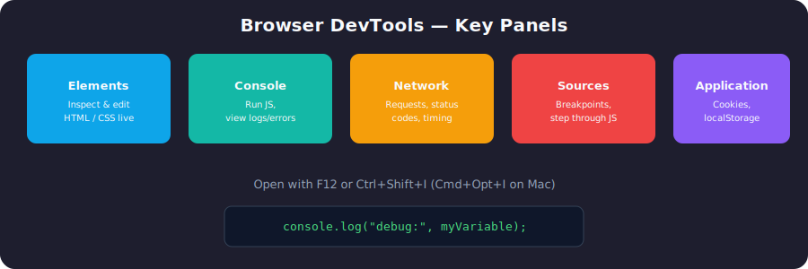

| Panel | What it's for |
|-------|----------------|
| **Elements** | Inspect and live-edit HTML & CSS |
| **Console** | Run JS snippets, view logs/errors/warnings |
| **Network** | Inspect requests, response status codes, load time |
| **Sources** | Set breakpoints, step through JS line-by-line |
| **Application** | View cookies, localStorage, sessionStorage, cache |

### Handy debugging commands
```js
console.log("value:", myVar);     // quick variable check
console.table(arrayOfObjects);    // clean tabular view
console.error("Something broke"); // styled error log
debugger;                         // pauses execution right here
```

> 💡 **Tip:** Use breakpoints in the *Sources* tab instead of sprinkling `console.log` everywhere — it lets you inspect the entire call stack at the point of failure.

---

## Day 3 — HTML5 Tags

Semantic HTML5 elements describe the **meaning** of content, not just its appearance — this improves **SEO** and **accessibility**.

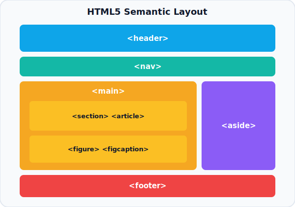

```html
<header>Site Header / Logo / Nav</header>

<nav>
  <a href="#">Home</a>
  <a href="#">About</a>
</nav>

<main>
  <section>
    <article>
      <h2>Blog Post Title</h2>
      <p>Content...</p>
    </article>
  </section>

  <aside>Sidebar / Related Links</aside>
</main>

<footer>Copyright &copy; 2026</footer>
```

**Other important tags:**

| Tag | Purpose |
|-----|---------|
| `<figure>` / `<figcaption>` | Image with a caption |
| `<video>` / `<audio>` | Embed media |
| `<form>` / `<input>` / `<label>` | Collect user input |
| `<table>` / `<tr>` / `<td>` | Tabular data |
| `<mark>` | Highlighted text |
| `<time>` | Machine-readable date/time |

---

## Day 4 — Basic Resume Build (HTML)

Built the **structural skeleton** of a resume using pure HTML — no styling yet, just clean semantic structure.

```html
<!DOCTYPE html>
<html lang="en">
<head>
  <meta charset="UTF-8">
  <meta name="viewport" content="width=device-width, initial-scale=1.0">
  <title>My Resume</title>
</head>
<body>
  <header>
    <h1>Your Name</h1>
    <p>Frontend Developer Intern</p>
  </header>

  <section id="about">
    <h2>About Me</h2>
    <p>Short intro about yourself...</p>
  </section>

  <section id="skills">
    <h2>Skills</h2>
    <ul>
      <li>HTML</li>
      <li>CSS</li>
      <li>JavaScript</li>
    </ul>
  </section>

  <section id="experience">
    <h2>Experience</h2>
    <article>
      <h3>DivSocial — Web Development Intern</h3>
      <p>Learning full-stack fundamentals.</p>
    </article>
  </section>

  <footer>
    <p>Contact: your.email@example.com</p>
  </footer>
</body>
</html>
```

---

## Day 5 — CSS Boilerplate & Selectors

### Standard CSS Reset / Boilerplate
```css
* {
  margin: 0;
  padding: 0;
  box-sizing: border-box;
}

body {
  font-family: Arial, sans-serif;
  line-height: 1.6;
  color: #333;
}
```

### Selectors Cheat-Sheet
```css
/* Type / Tag selector */
p { color: black; }

/* Class selector */
.card { border: 1px solid #ccc; }

/* ID selector */
#header { background: navy; }

/* Descendant selector */
nav ul li { list-style: none; }

/* Child combinator */
.parent > .child { margin-top: 10px; }

/* Pseudo-class */
a:hover { color: red; }
input:focus { outline: 2px solid blue; }

/* Attribute selector */
input[type="email"] { border-color: green; }
```

---

## Day 6 — Box Model, Flexbox & Grid

### 📦 The Box Model
Every HTML element is a rectangular box made of 4 layers:

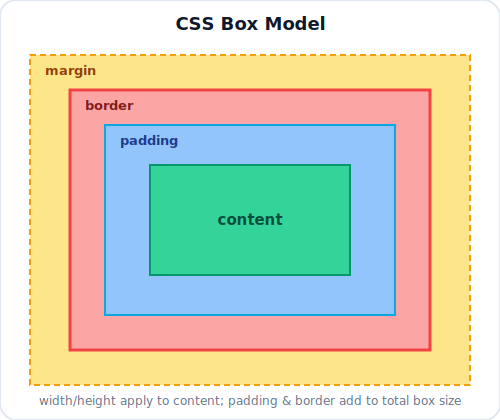

```css
.box {
  width: 200px;
  padding: 10px;   /* space inside the border */
  border: 2px solid black;
  margin: 20px;    /* space outside the border */
}
```

> ⚠️ By default, `width`/`height` apply only to **content**. Use `box-sizing: border-box` to include padding & border in the total width.

### Flexbox (1-Dimensional Layout)
```css
.container {
  display: flex;
  flex-direction: row;       /* or column */
  justify-content: center;   /* main axis alignment */
  align-items: center;       /* cross axis alignment */
  gap: 16px;
}
```

### Grid (2-Dimensional Layout)
```css
.container {
  display: grid;
  grid-template-columns: repeat(3, 1fr);
  grid-template-rows: auto auto;
  gap: 10px;
}
```

---

## Day 7 — When to Use Flexbox vs Grid

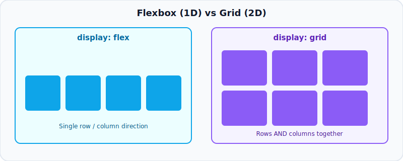

| Use Case | Best Choice |
|----------|-------------|
| Navbar / single row of links | **Flexbox** |
| Centering one item vertically & horizontally | **Flexbox** |
| Aligning items in one direction | **Flexbox** |
| Full page layout (header/sidebar/content/footer) | **Grid** |
| Rows **and** columns together | **Grid** |
| Photo/card gallery | **Grid** |

> 🧠 **Rule of thumb:** Flexbox = 1D (row *or* column). Grid = 2D (rows *and* columns *together*).

---

## Day 8 — Styling the Resume with CSS

Applied everything from Day 5–7 onto the Day 4 resume HTML.

```css
header {
  background: #2c3e50;
  color: white;
  padding: 20px;
  text-align: center;
}

#skills ul {
  display: flex;
  flex-wrap: wrap;
  gap: 10px;
  list-style: none;
}

#skills li {
  background: #ecf0f1;
  padding: 5px 12px;
  border-radius: 20px;
  font-size: 14px;
}

section {
  padding: 20px 40px;
  border-bottom: 1px solid #ddd;
}

footer {
  text-align: center;
  padding: 15px;
  background: #f1f1f1;
  font-size: 13px;
}
```

**Result:** A clean, card-style resume with a dark header, pill-shaped skill tags, and consistent section spacing.

---

## Day 9 — JavaScript Fundamentals

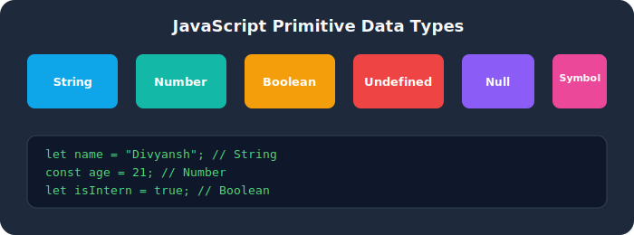

```js
// Variables
let name = "Divyansh";
const age = 21;
var oldWay = "avoid using var";

// Data types
let num = 10;          // Number
let str = "hello";      // String
let bool = true;        // Boolean
let arr = [1, 2, 3];    // Array
let obj = { key: "value" }; // Object
let nothing = null;
let notDefined;          // undefined

// Conditionals
if (age >= 18) {
  console.log("Adult");
} else {
  console.log("Minor");
}

// Loops
for (let i = 0; i < 5; i++) {
  console.log(i);
}

let j = 0;
while (j < 3) {
  console.log(j);
  j++;
}
```

---

## Day 10 — Functions in JS

```js
// Function declaration
function greet(name) {
  return `Hello, ${name}!`;
}

// Function expression
const add = function (a, b) {
  return a + b;
};

// Arrow function
const multiply = (a, b) => a * b;

// Default parameters
function greetUser(name = "Guest") {
  console.log(`Welcome ${name}`);
}

// Callback function
function processUser(name, callback) {
  callback(name);
}
processUser("Divyansh", (n) => console.log(`Processed: ${n}`));
```

**Key concepts:**
- **Parameters vs Arguments** — parameters are placeholders in the definition; arguments are actual values passed in.
- **Return values** — a function without `return` returns `undefined`.
- **Scope** — variables declared inside a function aren't accessible outside it.

---

## Day 11 — Arrays & Array Methods

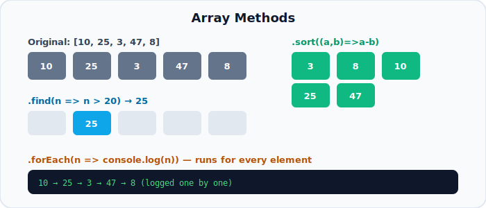

```js
const numbers = [10, 25, 3, 47, 8];

// find() -> returns the FIRST element that matches the condition
const found = numbers.find(n => n > 20);
console.log(found); // 25

// forEach() -> runs a function for every element (no return value)
numbers.forEach(n => console.log(n));

// sort() -> sorts in place (default sorts as strings, so use a comparator for numbers!)
const sorted = [...numbers].sort((a, b) => a - b);
console.log(sorted); // [3, 8, 10, 25, 47]

// Bonus methods
const doubled = numbers.map(n => n * 2);      // transform every element
const bigOnes = numbers.filter(n => n > 10);  // keep only matching elements
const total = numbers.reduce((sum, n) => sum + n, 0); // accumulate to single value
```

| Method | Returns | Use Case |
|--------|---------|----------|
| `find()` | First matching element | Search for one item |
| `forEach()` | `undefined` | Just loop / side-effects |
| `sort()` | Sorted array (mutates original) | Ordering data |
| `map()` | New transformed array | Convert every item |
| `filter()` | New filtered array | Keep matching items |
| `reduce()` | Single accumulated value | Totals, grouping |

---

## Day 12 — APIs & Basic Backend Concepts

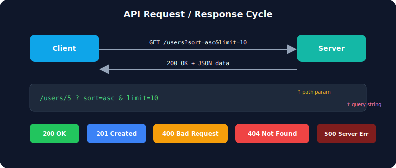

### Request / Response Cycle
```
Client  --HTTP Request-->  Server
Client  <--HTTP Response--  Server
```

### Common HTTP Status Codes

| Code | Category | Meaning |
|------|----------|---------|
| 200 | ✅ Success | OK |
| 201 | ✅ Success | Created |
| 301/302 | ↪️ Redirect | Moved permanently / temporarily |
| 400 | ⚠️ Client Error | Bad Request |
| 401 | ⚠️ Client Error | Unauthorized |
| 403 | ⚠️ Client Error | Forbidden |
| 404 | ⚠️ Client Error | Not Found |
| 500 | ❌ Server Error | Internal Server Error |

### Query String vs Path Parameter
```
https://api.example.com/users/5?sort=asc&limit=10
                        └──┬──┘  └──────┬───────┘
                     path param      query string
```
- **Path parameter (`/5`)** — identifies a *specific resource*.
- **Query string (`?sort=asc&limit=10`)** — optional filters/modifiers for the request.

### Request vs Response Headers
```http
# Request Headers (sent BY the client)
Content-Type: application/json
Authorization: Bearer <token>

# Response Headers (sent BY the server)
Content-Type: application/json
Cache-Control: no-cache
```

### Stateless Protocol
> HTTP is a **stateless protocol** — the server does not remember anything about previous requests. Every request must carry all the info the server needs (tokens, cookies, session IDs) to understand context.

### Example — Fetching Data with `fetch()`
```js
fetch("https://api.example.com/users?sort=asc")
  .then(response => response.json())
  .then(data => console.log(data))
  .catch(error => console.error("Error:", error));

// async/await version
async function getUsers() {
  try {
    const response = await fetch("https://api.example.com/users");
    const data = await response.json();
    console.log(data);
  } catch (error) {
    console.error("Error:", error);
  }
}
```

---

## Day 13 (13 July) — DevTools Application Tab, Storage & Cookies

Explored the **Application** tab in Chrome/Brave DevTools — this is where all client-side storage mechanisms of a website live (Manifest, Service Workers, Storage, Cookies, Cache, etc.).

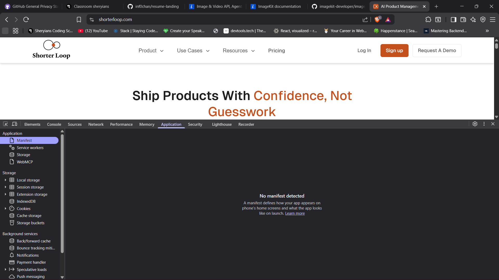

### Console (Recap)
The **Console** panel is used to run JS snippets live, inspect logged values, and read errors/warnings thrown by the page — the fastest way to sanity-check what a script is doing without adding UI.

### Application Tab
Found under DevTools → **Application**. Key sub-sections:

| Section | What it stores/shows |
|---------|------------------------|
| **Manifest** | The web app manifest (`manifest.json`) — defines app name, icons, theme color for installable PWAs. Shows "No manifest detected" if the site isn't a PWA. |
| **Service Workers** | Background scripts that enable offline support, push notifications, caching |
| **Storage** | Overview of Local Storage, Session Storage, IndexedDB, Cookies, Cache Storage — with a quota usage breakdown |
| **Background Services** | Back/forward cache, bounce tracking mitigation, notifications, push messaging |

### Storage — The 4 Main Types


| Feature | Cookies | Local Storage | Session Storage | IndexedDB |
|---------|---------|----------------|------------------|-----------|
| **Capacity** | ~4KB | ~5–10MB | ~5–10MB | Very large (100s of MB+) |
| **Sent to server?** | ✅ Yes, with every HTTP request | ❌ No | ❌ No | ❌ No |
| **Expiry** | Set manually (or session-based) | Never (until cleared) | On tab/browser close | Never (until cleared) |
| **Accessible from** | Client + Server | Client (JS) only | Client (JS) only | Client (JS) only |
| **Data type** | String only | String only | String only | Structured objects (key-value, indexed) |
| **Best for** | Auth tokens, session IDs | User preferences, theme, tokens | Per-tab form data, wizard steps | Offline apps, large structured datasets |

### Cookies
A **cookie** is a small piece of data (`name=value`) that the server asks the browser to store, and the browser sends back on every subsequent request to that domain.

```http
Set-Cookie: sessionId=abc123; Max-Age=3600; Path=/; Secure; HttpOnly; SameSite=Strict
```

Common attributes:
- `Expires` / `Max-Age` — controls lifetime
- `Path` / `Domain` — scope of the cookie
- `Secure` — only sent over HTTPS
- `HttpOnly` — not accessible via JS (`document.cookie`), protects against XSS
- `SameSite` — controls cross-site sending (Strict / Lax / None)

### HTTP vs HTTPS

| | HTTP | HTTPS |
|---|------|-------|
| **Full form** | HyperText Transfer Protocol | HyperText Transfer Protocol **Secure** |
| **Encryption** | ❌ None — data sent in plain text | ✅ Encrypted via TLS/SSL |
| **Port** | 80 | 443 |
| **Data safety** | Vulnerable to eavesdropping/tampering | Protected against man-in-the-middle attacks |
| **SEO / Trust** | Browsers flag as "Not Secure" | Padlock icon shown, preferred by browsers & Google |

> 🔗 Connects back to **Day 1** — the **TLS** handshake is exactly what upgrades a plain HTTP connection into HTTPS.

### Persistent vs Non-Persistent Cookies

| | Persistent Cookie | Non-Persistent (Session) Cookie |
|---|---------------------|-----------------------------------|
| **Expiry attribute** | Has `Expires`/`Max-Age` set | No expiry set |
| **Lifetime** | Survives browser restarts, until expiry date | Deleted the moment the browser closes |
| **Use case** | "Remember me", saved login, preferences | Temporary session/auth state |

### Local Storage
Key-value storage, **scoped per origin**, persists even after the browser is closed and reopened.

```js
localStorage.setItem("theme", "dark");
localStorage.getItem("theme");     // "dark"
localStorage.removeItem("theme");
localStorage.clear();              // wipes everything for this origin
```

### Session Storage
Same API as Local Storage, but **scoped per tab** — data is wiped as soon as that tab is closed.

```js
sessionStorage.setItem("step", "2");
sessionStorage.getItem("step");    // "2"
sessionStorage.clear();
```

### IndexedDB
A low-level, **asynchronous, client-side NoSQL database** built into the browser — used when you need to store large amounts of structured data (objects, files, blobs) rather than simple strings.

```js
const request = indexedDB.open("MyDatabase", 1);

request.onupgradeneeded = (event) => {
  const db = event.target.result;
  db.createObjectStore("users", { keyPath: "id" });
};

request.onsuccess = (event) => {
  const db = event.target.result;
  const tx = db.transaction("users", "readwrite");
  tx.objectStore("users").add({ id: 1, name: "Divyansh" });
};
```

---

## Day 14 (15 July) — npm, Node.js & Express Basics

Set up the backend of the **ResumeFlow** project using Node.js + Express, and learned the core tooling around package management.

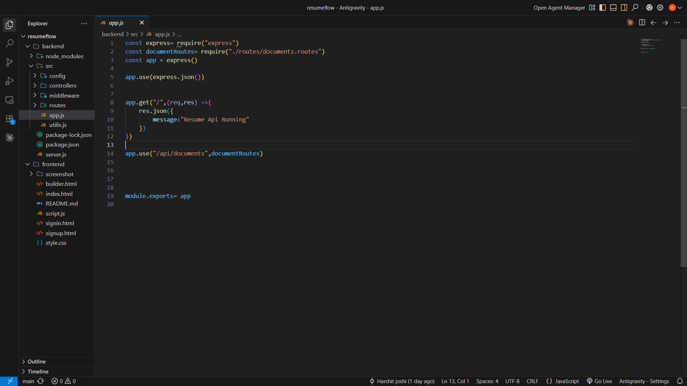

### ✅ npm (Node Package Manager)
`npm` is the default package manager for Node.js — it installs, updates, and manages third-party libraries.

```bash
npm init -y              # creates a package.json with defaults
npm install express       # installs a package + adds it to dependencies
npm install nodemon --save-dev   # installs as a dev-only dependency
npm uninstall <package>   # removes a package
```

### ✅ node_modules
The folder where **all installed packages (and their dependencies)** physically live. It's auto-generated by `npm install` and should **never be committed to Git** — hence it's always added to `.gitignore`.

### ✅ package.json
The manifest file of a Node.js project — describes the project and lists its dependencies.

```json
{
  "name": "resumeflow-backend",
  "version": "1.0.0",
  "main": "server.js",
  "scripts": {
    "start": "node server.js",
    "dev": "nodemon server.js"
  },
  "dependencies": {
    "express": "^4.18.2"
  },
  "devDependencies": {
    "nodemon": "^3.0.1"
  }
}
```

### ✅ package-lock.json
Auto-generated alongside `package.json`. It locks the **exact resolved version** of every package (and sub-dependency) that was installed, so every teammate/environment gets the **identical dependency tree** — preventing "works on my machine" bugs. Unlike `package.json`, it **should** be committed to Git.

### ✅ Semantic Versioning (Major.Minor.Patch)

```
4    .  18   .   2
▲       ▲        ▲
MAJOR   MINOR    PATCH
```

| Part | Changes when... |
|------|-------------------|
| **MAJOR** | Breaking changes, incompatible API changes |
| **MINOR** | New features added, backward-compatible |
| **PATCH** | Bug fixes only, backward-compatible |

Prefixes in `package.json`:
- `^4.18.2` → accepts updates within the same **MAJOR** version (e.g. up to `<5.0.0`)
- `~4.18.2` → accepts updates within the same **MINOR** version (e.g. up to `<4.19.0`)
- `4.18.2` (no prefix) → locked to that **exact** version

### ✅ nodemon
A dev dependency that **watches project files** and automatically restarts the Node server whenever a file is saved — removes the need to manually stop/restart the server after every change.

```bash
npm install nodemon --save-dev
```
```json
"scripts": {
  "dev": "nodemon server.js"
}
```
```bash
npm run dev
```

### ✅ `app.use(express.json())`
Built-in Express **middleware** that parses incoming requests with a `Content-Type: application/json` body and makes the parsed data available on `req.body`. Without it, `req.body` would be `undefined` for JSON requests.

### 🧩 Putting it together — `app.js`

```js
const express = require("express");
const documentRoutes = require("./routes/documents.routes");
const app = express();

app.use(express.json());   // parses incoming JSON bodies -> req.body

app.get("/", (req, res) => {
  res.json({
    message: "Resume Api Running"
  });
});

app.use("/api/documents", documentRoutes);   // mounts all document routes under /api/documents

module.exports = app;
```

> 🔗 **Flow:** `server.js` imports this `app`, calls `app.listen(PORT)`, and every request to `/api/documents/...` gets forwarded to the `documentRoutes` router.

---

## ✅ Key Takeaways

Over these days at **DivSocial**, I learned:
- 🌐 How the web works end-to-end — DNS → TCP → TLS → HTTP → Render
- 🐞 Debugging with browser DevTools like a pro
- 🏷️ HTML5 semantic structure & building a real resume from scratch
- 🎨 CSS fundamentals — selectors, the box model, Flexbox, and Grid
- ⚙️ JavaScript fundamentals — variables, functions, arrays, and array methods
- 🌍 Backend/API basics — status codes, headers, query params, and statelessness
- 🗄️ Browser storage — Cookies, Local Storage, Session Storage & IndexedDB, and HTTP vs HTTPS
- 📦 Node.js tooling — npm, node_modules, package.json/package-lock.json, Semantic Versioning, nodemon, and Express middleware (`express.json()`)

---

<div align="center">

*📌 Maintained as part of my DivSocial Internship learning journey.*

</div>
